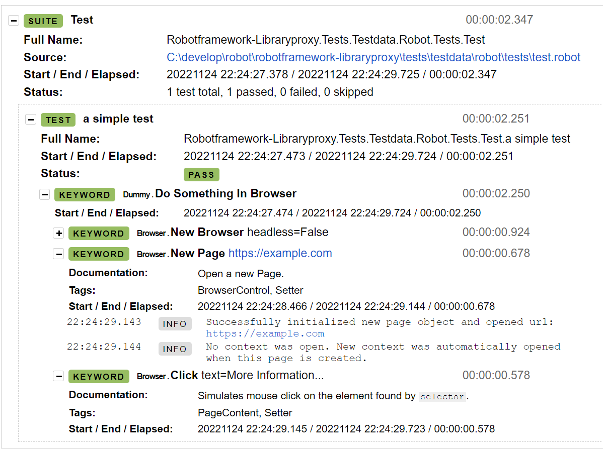

# robotframework-libraryproxy

Simple library for calling RobotFramework keywords from Python, with the possibility to log them in the output.

Example Python library:

```python
from Browser import Browser
from robotlibraryproxy import library_proxy

def do_something_in_browser(self):
    with library_proxy(Browser) as browser:
        browser.new_browser(headless=False)
        browser.new_page("https://example.com")
        browser.click("text=More Information...")

```

or another way as python descriptor:

```python
from Browser import Browser
from robotlibraryproxy import library_proxy


class Dummy:

    browser = library_proxy(Browser)

    def do_something_in_browser(self):
        self.browser.new_browser(headless=False)
        self.browser.new_page("https://example.com")
        self.browser.click("text=More Information...")

```

Example Test case that uses this library:

```robotframework
*** Settings ***

Library    Dummy.py

# Library    Browser

*** Test Cases ***

a simple test
    Do Something In Browser

```

An excerpt from the Robot log:




more comming soon...
